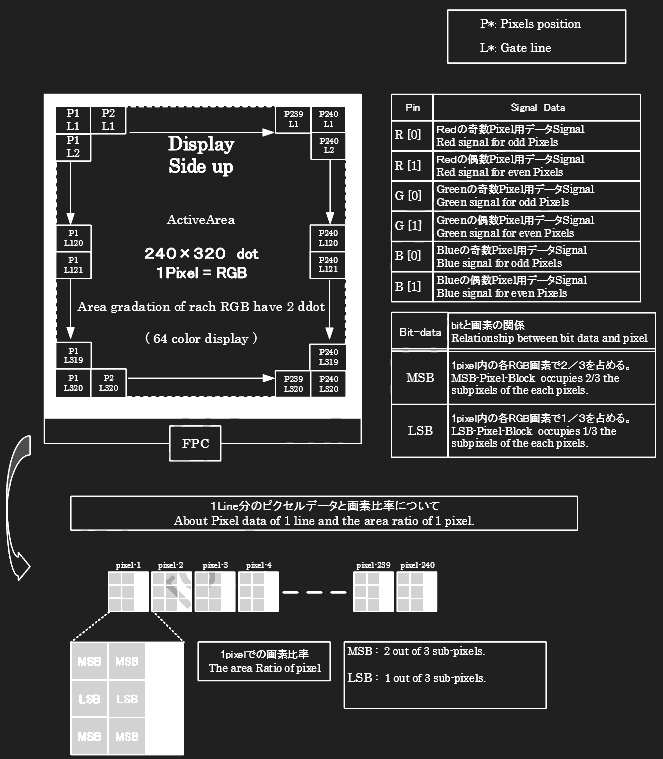
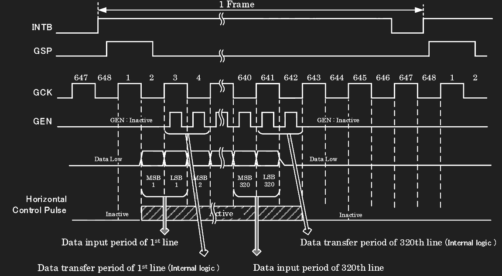
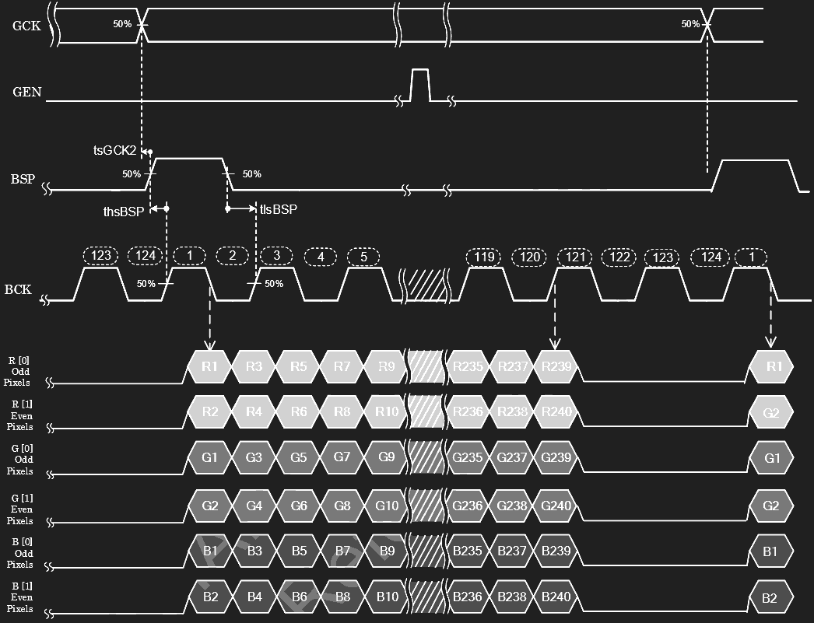
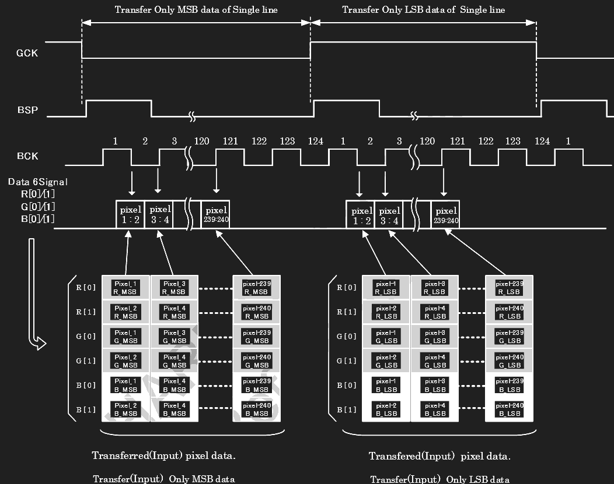
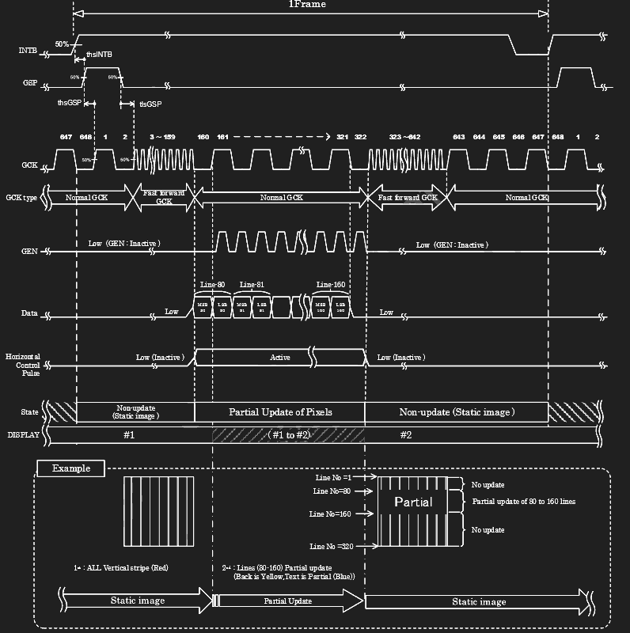
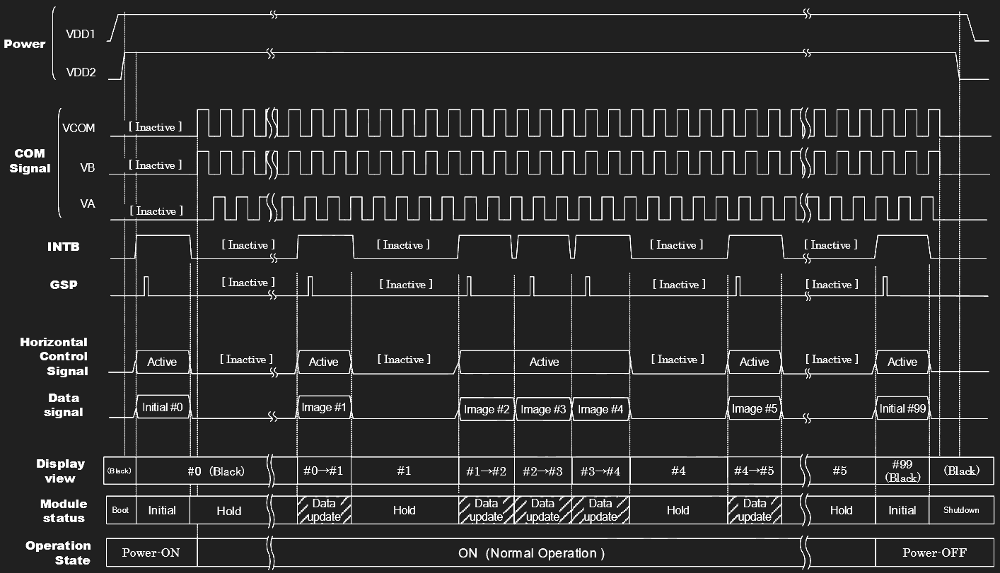
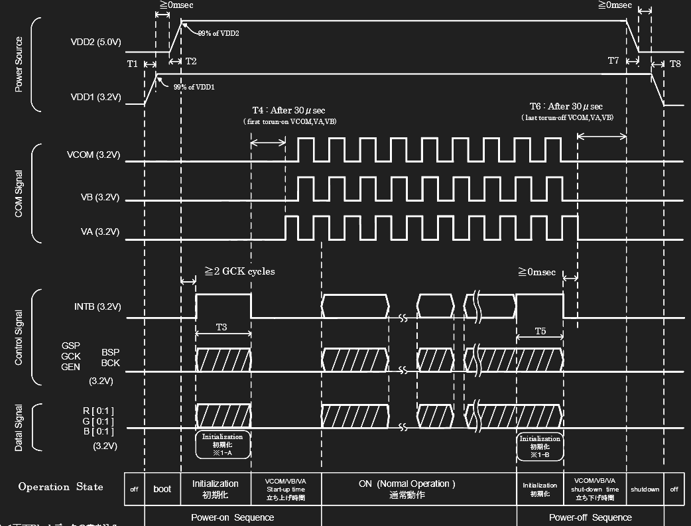

# Sharp 64-Color Display Driver Notes

Sharp 64-Color Display(s) (currently I am only aware of the one) use a 6-bit parallel bus that has nothing in common with the monochrome SPI interface which is nicely laid out in a separate programming document. Since I found the datasheet on signals and timing tough to wrap my head around, some notes seemed appropriate to help at least myself if not others. Also, the seemingly unique way the display updates might reveal some code optimizations by understanding each piece.

## Protocol Basics

|Pin #  |Pin Name  |Function  |
|---------|---------|---------|
|1     |VDD2        |5V         |
|3     |GSP         |Gate (Vertical) Start?         |
|4     |GCK         |Gate Clock         |
|5     |GEN         |Gate Enable         |
|6     |INTB        |Gate/Binary Initial?  |
|7     |VB          |VCOM         |
|8     |VA          |VCOM Inverse         |
|9     |VDD1        |3.3V         |
|10    |VSS         |GND         |
|11    |BSP         |Binary (Horizontal) Start         |
|12    |BCK         |Binary Clock         |
|13    |R[0]        |Red Odd         |
|14    |R[1]        |Red Even         |
|15    |G[0]        |Green Odd         |
|16    |G[1]        |Green Even         |
|17    |B[0]        |Blue Odd         |
|18    |B[1]        |Blue Even         |
|20    |VCOM        |Alternating Square Wave Signal         |

There are 18 used pins on the 21-pin display connector, of which 2 are power (5V/3.3V), 1 ground, and 3 reserved for VCOM and its equal and inverse signal counterparts VB and VA, respectively. We'll look at startup/shutdown sequence where these matter but for now they can be overlooked, with VCOM just being a consistent 60Hz(ish) square wave that in some way keeps the display running.

Besides the arbitrary VCOM signal things seem pretty normal so far. Since the module uses 2 bits per color and therefore 6bpp, you would intuitively expect the 6 parallel signals to represent a single pixel per cycle. And, you'd be ***very wrong***. Instead, each cycle provides half the information (MSB) for 2 horizontal pixels (even and odd). Once half the color information for the whole line has been written, you send the other half (LSB) and then drop down a line and repeat. I'm guessing this seemingly strange way of writing to the display is down to the unique setup of the LCD, but maybe this is a common way to set things up for RGB parallel interfaces.

The display also allows for partial updating, essentially just skipping horizontal lines that don't need to be updated.

## Vertical Signal

The "outer loop" of updating each frame is in the vertical movement signaling as seen in the given strangely redundant figures. Each Gate Clock cycle is one horizontal line written to the display.

Looking at the clock/control signals here, the display update is first triggered when INTB has a rising edge (and it has a corresponding dip a half cycle before the display update ends). GSP fires for a full GCK cycle at the start of each new display update. Gate Enable (GEN) pulls high during each stable point in GCK.

At the 642nd GCK pulse, everything goes stable for 6 cycles as seen in the figure.

## Horizontal Signal

Here we are zooming in on one single GCK cycle. The horizontal clock signal (BCK) is around 0.75MHz which is faster than I would have thought but makes sense considering it ticks for every pixel (probably warranted more careful trace design for the prototype but we can always run it slower for now if it's an issue... something to keep in mind). Each full horizontal cycle delivers one period of MSB bits and another of LSB bits for the full line. Once we have that part in our minds, it's probably the simpler part of the protocol. Each BCK cycle moves over one pixel, with BSP triggered high at the start of each line for a period of a full BCK cycle.

## Partial Update

If we only want to update some of the horizontal lines, there's a protocol provided for skipping through faster vertically.

## Pulling It All Together

There are a couple other things we have to keep in mind, mainly transitioning between commands and powering on/off.

